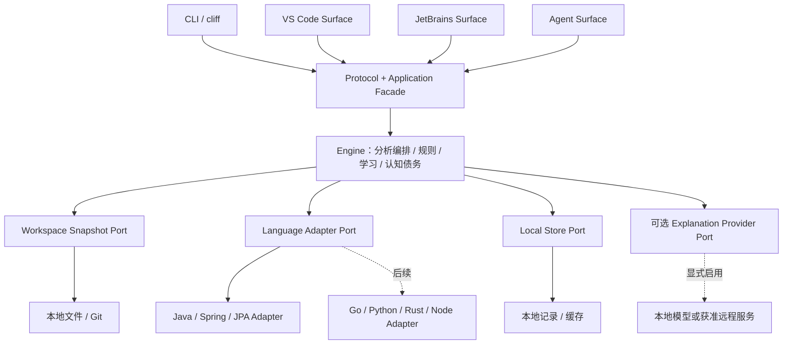

# Code X-Ray 架构蓝图

文档版本：1.1。状态：**设计约束与起始方案，产品尚未实现**。验收范围以 [PRD](PRD.md) 为准，最高约束见 [项目宪法](CONSTITUTION.md)，实际完成情况只看 [CURRENT](state/CURRENT.md) 与 [EVIDENCE](state/EVIDENCE.md)。

## 1. 一个 Engine，四个 Surface

CLI、VS Code、JetBrains、Coding Agent 是同一产品的四个入口，各自负责呈现和宿主交互。分析、风险规则、执行路径、学习内容与认知债务都属于 Engine。不得把 Spring/JPA 规则写进命令回调、编辑器扩展或模型提示词。



模块应以小而稳定的接口封装完整职责：调用方请求“分析这个快照”，无需知道 AST、缓存目录、JPA 注解枚举或 provider SDK。每增加一个接口或配置，说明调用方为何需要它；不要为每个类制造一层转发服务。

## 2. 起始技术方案与验证边界

| 层 | 起始方案 | 必须先验证的内容 |
|---|---|---|
| Engine / CLI | TypeScript、Node.js、pnpm workspace；Vitest、Biome | T001 固定兼容的运行时/工具版本与锁文件；不凭上游 engines 下限推断所有版本均受支持 |
| CLI infrastructure | `@cliffx/core`、`@cliffx/ui`、`@cliffx/test`，通过 CLI 适配层使用 | T002 完成安装来源、许可材料、离线、参数、打包、退出码与终端验证；详见 [cliff 接入](CLIFF_INTEGRATION.md) |
| Canonical Protocol | JSON Schema Draft 2020-12；从 schema 生成或校验语言类型 | T003 有真实 schema、正反例与跨序列化契约测试后才算落地 |
| Java 分析器 | 首选候选：本地 JVM sidecar + JavaParser；从源码构建 AST，按需做有限符号解析 | T005 验证 fixture、支持的 Java 语法级别、JDK 要求、分发体积、冷启动、无法解析时降级；选择写入 Decision |
| 本地持久化 | 版本化 JSON 文件 + JSONL 事件；临时文件写入后原子替换；单写入者 | T004/T008 验证崩溃恢复、迁移、幂等、缓存失效；达到真实查询瓶颈再考虑 SQLite |
| LLM | provider-neutral 端口，默认 disabled；请求前统一隐私检查 | T009 验证无 provider、拒绝网络、超时、无效引用、供应商替换与删除缓存 |

JSON Schema 与 JSON-RPC 的选择分别依据其[官方 schema 规范](https://json-schema.org/draft/2020-12)和[JSON-RPC 2.0 规范](https://www.jsonrpc.org/specification)。JavaParser 是能够提供 Java AST 与符号分析能力的候选基础设施，参考[官方仓库](https://github.com/javaparser/javaparser)；这不等于已证明它覆盖 Code X-Ray 的 Spring/JPA 场景。

**Parser spike 的退出条件**：同一 fixture 集上保存准确率、未解析比例、运行时与分发约束。若 JavaParser 不满足目标，比较一个替代候选（例如语法树解析器 + 更保守的语义层），按 Decision 更换实现；Protocol 与其他模块继续推进。不得为消除 parser 不确定性直接调用被分析项目的 Maven/Gradle 构建、注解处理器或任意脚本。

## 3. 建议目录与依赖规则

以下是后续 T001–T010 要创建的产品目录；本启动包仅包含文档，不声称这些模块已经存在。

```text
apps/
  cli/                    # cliff 命令与终端 presenter
  engine-host/            # 本地 stdio bridge；第二个宿主接入前完成
  vscode/                 # v0.2 创建
  jetbrains/              # v0.3 创建，可使用 Kotlin
  agent/                  # v0.4 创建，宿主协议桥接
packages/
  protocol/               # canonical schemas / capability / compatibility fixtures
  engine/                 # facade、用例、规则调度、学习与 debt 领域逻辑
  workspace-local/        # safe snapshot、Git adapter、路径与隐私规则
  analyzer-java-client/   # Java sidecar 的端口实现
  storage-local/          # 缓存、个人状态、迁移与恢复
  explanation-providers/ # 可选 provider 实现；SDK 仅限这里
analyzers/
  java/                   # JVM worker / AST 与 Java-framework extraction
fixtures/
  java-spring-jpa/         # 正例、反例、unknown 与不支持场景
docs/                     # 本包中的规格、固定入口与接力状态
```

强制依赖方向：Surface → facade / Protocol；Engine → 自己定义的 ports / Protocol；infrastructure 实现 ports；composition root 负责装配。Engine 与 Protocol 不得 import cliff、VS Code API、JetBrains API、provider SDK。Java 侧可使用 Java 专有 AST，但不得将 AST 节点或 JVM 类型作为公共返回值。语言专有字段放在有命名空间和版本的 `extensions.java`，通用 finding 与 evidence 无需理解其内部结构。

## 4. 分析流水线

1. **Prepare**：解析显式目标路径和隐私策略，确认真实路径位于授权工作区，记录能力与限制。扫描命令只读取源码，不修改被扫描项目。
2. **Snapshot**：冻结文件清单、内容摘要和 Git 基线；读取时与摘要对应。若扫描期间文件改变，记录快照不一致并重试受影响文件，不能把新旧内容拼成事实。
3. **Extract**：Language Adapter 输出事实、位置、有限调用关系与 diagnostics。每个解析失败是可见的 coverage 缺口。
4. **Analyze**：版本化规则读取事实，生成 finding 与证据引用。依赖无法解析时产生 unknown 或降级的推断，不能输出“安全”。
5. **Explain**：先用确定性模板说明代码机制、风险条件和下一步验证；可选 LLM 仅增强表述与类比。
6. **Learn**：按 finding / concept 映射学习卡、用户自报掌握情况与可复核的小练习。使用代码上下文解释，不泛化成课程长文。
7. **Persist / Present**：本地保存结果、版本与 provenance；CLI/编辑器根据同一结果渐进展开。

分析结果应包含 `complete | partial | cancelled | failed`。`complete` 仅表示在报告的输入与支持范围内完成了分析；不得解释为程序运行正确或不存在缺陷。`partial` 必须列出缺失内容以及哪些结论受影响。

`scan` 支持普通目录，Git 元数据可为空；非 Git 目录不得因此被拒绝。Git diff 必须使用用户显式提供的 base，记录解析后的 commit SHA 与目标快照；非 Git 目录或 base 无效时仅 `diff` 明确失败，不能偷偷比较任意分支。结果区分新增、持续、已移除和无法比较。规则版本/解析能力变化时，提示 baseline 不可直接比较。删除或重命名文件仍保留原证据坐标；路径变更不等同于问题已修复。

## 5. 统一领域数据契约

T003 将下表实现为真实 schema。当前示例是设计，不是可直接导入的 SDK。

| 对象 | 必备字段 | 关键语义 |
|---|---|---|
| `AnalysisRequest` | `schemaVersion`, `requestId`, `workspace`, `scope`, `privacy`, `limits` | `scope` 指文件/模块/显式 diff；不承载 shell 命令；`privacy` 默认禁止外发 |
| `Snapshot` | `id`, `fileDigests`, `gitBase?`, `targetRevision?`, `dirty`, `createdAt` | 未提交与未跟踪内容若被选中必须纳入摘要；不能只记录 HEAD |
| `SourceLocation` | `relativePath`, `contentDigest`, `start`, `end`, `coordinateSystem` | 行列均一基；Unicode code point 列；范围起点包含、终点不包含；Surface 显式转换宿主坐标 |
| `Evidence` | `id`, `kind`, `snapshotId`, `locations`, `producer`, `observation` | 观察结果与方法/版本绑定；源码摘录按需加载，默认不随报告外发 |
| `Claim` | `id`, `statement`, `epistemic`, `evidenceIds`, `assumptions`, `limitations` | `epistemic` 取 fact、inference、recommendation、unknown；fact 必须有可追溯观察，inference 写前提，recommendation 表示建议行动，unknown 写缺失信息 |
| `Finding` | `id`, `ruleId`, `ruleVersion`, `severity`, `claimIds`, `conceptIds`, `nextCheck` | 风险严重性和证据确定性分开；结果 ID 可追踪，不含秘密明文 |
| `Flow` | `nodes`, `edges`, `entry`, `coverage`, `limits` | 每条边带 observed、inferred 或 unresolved 状态及证据；静态候选路径不得称作实际运行 trace |
| `LearningCard` | `conceptId`, `findingIds`, `what`, `whyHere`, `hiddenMechanisms`, `whatIfChangedOrRemoved`, `example`, `check`, `references` | 四段内容必填；条件性影响需保留前提与证据；来源与适用版本明确，前端类比可选且说明边界 |
| `CognitiveDebtItem` | `conceptId`, `codeRefs`, `riskContext`, `learningState`, `evidenceRefs` | 描述概念与维护场景之间的未验证理解，不给个人能力打分 |
| `AnalysisResult` | `schemaVersion`, `analysisId`, `snapshot`, `status`, `coverage`, `claims`, `findings`, `evidence`, `diagnostics`, `provenance` | 保留不支持范围、所用规则/解析器/配置版本、LLM 是否参与 |

`fact` 的例子是“源码方法 A 标有某全限定名注解”，不包括“运行时一定开启事务”。静态规则即便完全确定地运行，也可能只能生成 `inference`。source line、rule observation 与实际执行的测试证据不能互相冒充。

证据分两类：产品报告中的 `Evidence` 描述被分析项目；[开发 EVIDENCE](state/EVIDENCE.md) 描述 Code X-Ray 自身的验证。两套 ID 命名空间必须分开，不可用产品示例 finding 当成开发任务通过的证明。

## 6. Facade 与可替换端口

公共用例保持有限：

```text
getCapabilities() -> Capabilities
analyze(AnalysisRequest) -> AnalysisResult
explain(analysisId, findingId, detailLevel) -> Explanation
getLearningCard(analysisId, findingIdOrConceptId) -> LearningCard
recordLearningEvent(eventId, conceptId, event, references) -> LearningState
getCognitiveDebt(workspaceId, filters) -> CognitiveDebtSummary
cancel(requestId) -> CancellationAcknowledgement
```

`eventId` 用于学习状态写入幂等；重复请求不重复增加练习、债务或完成次数。`explain` 发现快照已经过期时展示“基于历史快照”，提供重新分析；不能悄悄改变证据。

| Port | 输入 / 输出边界 | 禁止泄漏 |
|---|---|---|
| WorkspaceSnapshotPort | 受限文件读取、内容摘要、Git baseline | 任意 shell、宿主绝对路径进入共享报告 |
| LanguageAdapterPort | `capabilities / analyze(snapshot handles, options) -> facts + diagnostics` | AST 对象、JavaParser 类型、编辑器 API |
| LocalStorePort | 带 schema version 的读写/迁移、事务性状态变更 | 任意跨目录写入、隐式远程同步 |
| ExplanationProviderPort | 最小 EvidenceBundle + 输出结构约束 | 自动读取仓库、任意工具调用、直接改事实库 |

Java sidecar 接收经筛选的文件内容或受限快照句柄，使用显式 executable + argv 启动，不能拼 shell 字符串。限制消息大小、运行时、内存与并发；错误/日志进入 stderr，stdout 只承载协议。sidecar 崩溃会生成诊断并结束当前分析，保留可用的部分结果；不无限重启。

## 7. 跨语言传输、版本与兼容

CLI v0.1 可以进程内调用 facade，但输入输出仍通过 canonical schema 验证。第二个 Surface 接入前，使用本地 stdio JSON-RPC 2.0 bridge，方法映射到同一 facade；不用复制分析逻辑。推荐一行一个完整 JSON 消息的 framing，字符串内换行必须转义，单条消息设置上限。通知、取消、超时、终止的具体契约由 T003 编写 fixture，bridge 通过回环测试后才能标注可用。

版本分别记录：`protocolVersion`、`schemaVersion`、`engineVersion`、`adapterVersion`、`ruleSetVersion`、`learningContentVersion`、`storageVersion`。初始产品协议使用 `0.1`，明确支持范围；不以产品版本代替所有数据版本。

- 握手返回支持的协议版本和 capabilities；版本无交集时返回可理解错误。
- 已有字段不改含义、不改类型；新增可选字段先验证旧客户端行为；新 enum 值也需兼容策略。
- 不兼容变更提升协议版本，保留旧版读取/迁移策略与正反例；发布前重放保存的契约 fixture。
- 调用 ID 与分析 ID 分开；取消不能返回 complete。内部错误码稳定，用户文案可本地化。
- Agent Surface 可再适配宿主的工具协议；不得把某供应商 tool-call 格式当成领域协议。

## 8. Java / Spring / JPA 的能力边界

v0.1 聚焦单个 Maven/Gradle 源码模块的静态分析。读取构建描述用于识别依赖和源码目录，但不运行构建、不下载项目依赖、不启动 Spring、不访问数据库。

Java Adapter 优先识别类、方法、字段、注解及其 imports，全限定名、继承和有限调用关系；Spring/JPA 语义提取在 Java Adapter 内部的 framework 子模块完成。支持矩阵必须列明 Java 语法级别、`javax.persistence` / `jakarta.persistence`、Spring 注解形式与未支持项。简单同名注解不能自动视为 Spring 注解。

动态代理、反射、自定义元注解、条件 Bean、多实现注入、Lombok 生成成员、AOP/AspectJ、外部库符号和运行时事务传播可能超出 v0.1 能力。每项通过正例、反例、unknown fixture 定义边界；无法解析不能消失在结果里。

首批规则以 PRD 的三条有限静态规则为准。每条规则注册：ID、版本、支持前提、严重性依据、事实查询、推断与例外、证据位置、下一步人工/测试验证、概念映射、false-positive fixture。禁止宣称识别完整 N+1、完整事务正确性或全项目执行流。

## 9. 确定性、缓存与 LLM 增强

相同快照 + 配置 + 解析器/规则/内容版本，应生成等价的确定性事实与 findings；时间戳、请求 ID 等运行字段单独放在 provenance。稳定排序、固定去重策略、明确路径规范化；不要让并行完成顺序改变结果。

缓存键至少覆盖文件内容摘要、目标/基线、adapter 版本、规则集版本、有效配置、隐私策略和 schema 版本。符号依赖变化必须使相关规则缓存失效；先实现正确的全量重算，再增量优化。个人学习状态不混入可共享的源码分析缓存。

LLM 只接收经过隐私过滤的最小证据包：相关事实、允许的片段、概念与输出 schema。输出必须通过 schema 和 evidence ID 存在性校验，新增推断标记 `inference`，缺少来源的建议单独显示。引用存在不等于引用支持结论：事实槽位由确定性层提供，模型只能引用；推断保留前提与未知，不支持的解释拒绝或退回模板。T009 必须包含“真实 evidence ID 搭配不受支持结论”的负例。不能用 LLM 把 unknown 提升为 fact，不能让其关闭静态告警或替用户确认掌握。

provider 超时、拒绝、费用预算耗尽或不可用时，保留确定性报告和本地模板。每次增强记录 provider/model 标识、prompt 模板摘要、输入证据摘要和输出版本；不保存凭证，默认不记录原始敏感请求。

## 10. Local / Privacy first 的实现边界

- 默认不联网、不遥测、不检查更新；启用 provider 的授权应明确目的、服务地址、数据范围与保留设置。`--offline` 优先于已保存的联网偏好。
- 忽略规则包括仓库忽略规则、Code X-Ray exclude 与内置秘密/构建产物过滤；未跟踪文件仅在明确 scope 下纳入。路径 realpath 校验，拒绝 symlink 越出工作区；限制文件大小与文件数量，跳过项计入 coverage。
- 被分析源码、注释、README、构建脚本与输出均是数据，不能作为对 Agent/Engine 的指令。扫描不会执行其中的命令、插件或配置代码。
- 默认本地状态放在用户数据目录，按 workspace 标识隔离；项目内仅保存用户选择共享的非敏感配置。源码片段、绝对路径、学习画像、提示词内容不默认进入版本库。
- 支持按工作区删除分析记录、缓存和学习记录，说明删除范围；导出前可预览、脱敏并选择内容。
- 扩展加载、安装依赖与产品运行权限分开；开发安装需要网络不代表运行时可以联网。以网络拦截验证零外发，不靠“未配置 API key”推断隐私达标。

## 11. UI 与阶段验收

CLI 命令遵循 PRD：`scan`、`diff --base`、`explain`、`learn`、`debt`、`doctor`；`xray` 无参数等价于 `xray scan .`，由 CLI adapter 在进入 cliff 前完成这一映射。Presenter 从同一结构化结果生成摘要、证据细节、机制解释和学习入口。JSON stdout 只输出机器可读结果；进度/诊断去 stderr；非交互模式不得等待输入。窄终端、中文宽度、无色模式与取消流程均需演示证据。

CLI 退出码的唯一契约如下，所有 Surface 应映射到相同结果语义，而不是照搬 CLI 数字：

| 退出码 | 含义 |
|---|---|
| `0` | 请求在声明范围内完成；发现风险仍是成功生成报告，不代表代码安全 |
| `1` | 执行失败或必需运行时不可用；返回结构化错误与可行动提示 |
| `2` | 参数、路径、配置或显式 Git 基线无效 |
| `3` | 请求部分完成或所选范围不受支持；必须展示 coverage 与限制 |
| `4` | 请求因隐私/工作区访问策略被阻止 |
| `130` | 用户取消；不能写入“完整成功”结果 |

v0.1 不隐式依据 finding 严重度改变退出码；未来 CI 阈值策略需单独定义，不能让旧调用方含义改变。JSON 成功与失败均输出一个合法结果 envelope，包含 schemaVersion、status、data 或 error；stderr 只含无敏感内容的诊断。cliff 原生的错误终止行为由 CLI adapter 适配到此契约。

隐私操作使用 `xray cache clear --workspace <path>` 清除此工作区的派生缓存；`xray data delete --workspace <path> [--include-learning]` 删除分析记录和缓存，只有显式 `--include-learning` 才包含个人学习记录。后者在 TTY 展示范围并确认，非 TTY 需要 `--yes`，否则以 `2` 退出且不写入。确认页只说明删除范围；不混入开发实现细节。源码与项目配置均不属于删除目标。两条命令都支持 `--format json`，删除完成后验证所列记录已移除。

| 阶段 | 可独立交付内容 | 通过标准 |
|---|---|---|
| v0.1 CLI | 本地 deterministic 核心闭环 + 可选增强 | T001–T010 达到 PRD 验收；离线 fixture、打包 CLI、同一分析到学习/debt、接力演练均有证据 |
| v0.2 VS Code | 编辑器选择范围、摘要面板、证据跳转与学习卡 | 真实扩展宿主 smoke test；与 CLI 对相同快照的结果一致；无独立规则引擎 |
| v0.3 JetBrains | 完整分析/学习闭环、证据导航及 Bean/事务/JPA 深化 | Kotlin/宿主协议往返、索引/取消/坐标验证；新增事实标注能力与来源，规则留在 Engine；PRD V03 全部满足 |
| v0.4 Agent integration | 分析/解释工具、修改后审查、变更前后证据与产品报告恢复 | 至少两个不同 Agent 宿主通过同一契约；不依赖私有对话记忆；保留 unknown 与隐私边界；PRD V04 全部满足 |

逐版本完整范围与 V02/V03/V04 验收以 PRD 第 8 节为准。不同 Surface 只在相同输入快照、配置、版本与能力集合下要求规范化事实一致；PSI 等补充事实必须标注来源。产品报告恢复不等于本项目 Markdown 开发进度接力，后者从项目启动即生效。

每阶段都执行 [Loop 协议](LOOP_PROTOCOL.md)。先实现一个可验证的纵向闭环，再扩大支持范围；后续 Surface 的设计不能成为提前实现四套界面的理由。实际进度、未验证选择与下一步写入 [CURRENT](state/CURRENT.md)、[BACKLOG](state/BACKLOG.md) 和 [DECISIONS](state/DECISIONS.md)。
